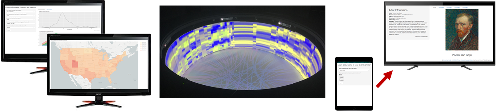

# mwshiny-examples: Examples for Multi-Window Shiny

<p align="center">

</p>

## Overview

This repository is a small set of examples for the mwshiny package in R for various multi-monitor situations, as presented at useR! 2019 in Toulouse, France. The examples demonstrate the following:

1. Multiple Monitors at a Workstation (Population Dynamics): folder "pop"
2. Controller Driving External Monitor (Cultural Exploration through Art): folder "art"
3. Alternative Visualization Structures through the [Rensselaer Campfire](https://empac.rpi.edu/program/research/campfire) (Circadian Rhythm Functionality): folder "health"

## Use and First-Time Set Up Instructions

1. Download [R](https://www.r-project.org/) and [RStudio](https://www.rstudio.com/products/rstudio/download/).
2. Download/clone this repository.
3. After opening RStudio, open the main R script of the example you're interested in, listed below:

| Folder | R Script |
| ------------- | ------------- |
| pop  | pop_mwshiny.R  |
| art  | art_app.R  |
| health  | encore_demo.R  |

4. Install all packages required (these are listed at the beginning of the script) using the function `install.packages()` or the corresponding Bioconductor installation code.
5. For both the pop and art examples, you will need a Mapbox access token. You can get that [here](https://www.mapbox.com/studio/). Once you have that token replace the empty string in the following code in the script with your Mapbox token:
```r
mapbox <- ""
```
6. For the pop example, you will need a US Census API token. You can get that [here](https://api.census.gov/data/key_signup.html). Once you have that token replace the empty string in the following code in the script with your US Census token:
```r
key <- ""
```
7. For the health example, supporting files are too large to upload to GitHub. To learn more about downloading the data and about this methodology, check out ENCORE [here](https://github.com/delosh653/ENCORE).
8. Once you're done downloading/replacing everything, run the script! Enjoy!

## Data Information

Data for each of the examples come from:

| Example | Source |
| ------------- | ------------- |
| pop  | US Census 2010  |
| art  | Wikipedia  |
| health  | [Hughes, et al. (2009)](https://journals.plos.org/plosgenetics/article?id=10.1371/journal.pgen.1000442) |

## Contact

Hannah De los Santos /
email: delosh@rpi.edu /
Rensselaer Polytechnic Institute
